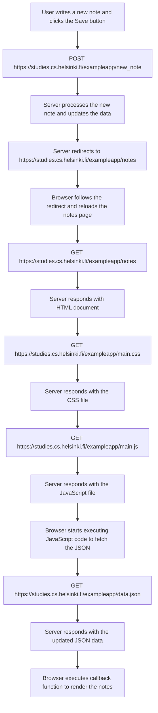

```mermaid
graph TD
    A[User writes a new note and clicks the Save button] --> B[POST https://studies.cs.helsinki.fi/exampleapp/new_note]
    B --> C[Server processes the new note and updates the data]
    C --> D[Server redirects to https://studies.cs.helsinki.fi/exampleapp/notes]
    D --> E[Browser follows the redirect and reloads the notes page]
    E --> F[GET https://studies.cs.helsinki.fi/exampleapp/notes]
    F --> G[Server responds with HTML document]
    G --> H[GET https://studies.cs.helsinki.fi/exampleapp/main.css]
    H --> I[Server responds with the CSS file]
    I --> J[GET https://studies.cs.helsinki.fi/exampleapp/main.js]
    J --> K[Server responds with the JavaScript file]
    K --> L[Browser starts executing JavaScript code to fetch the JSON]
    L --> M[GET https://studies.cs.helsinki.fi/exampleapp/data.json]
    M --> N[Server responds with the updated JSON data]
    N --> O[Browser executes callback function to render the notes]

```
